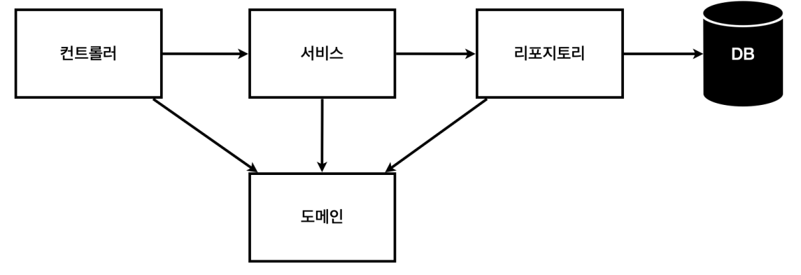
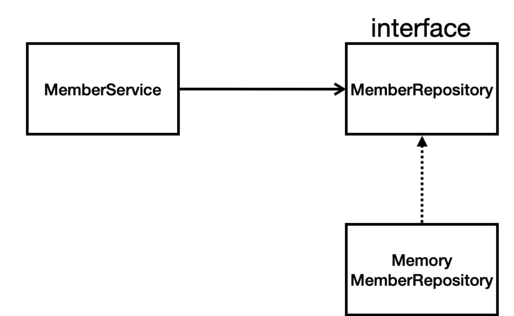

### 프로젝트 설정

https://start.spring.io/

Project : Gradle Project 선택

버전 : 3.2.5. 선택

dependencies : Spring Web, Thymeleaf(html을 만들어주는 템플릿 엔진)

dependencies를 Maven Central에서 다운받아라

hellospringapplication

실행

@SpringBootApplication 얘가 톰캣이라는 웹서버를 자체적으로 띄우면서 스프링 부트가 같이 올라옴

IntelliJ Gradle 대신에 자바 직접 실행

Gradle을 통해서 실행하면 느릴 때가 있음 -> 자바로 바로 실행하는 방법

### 라이브러리 살펴보기

External Libraries -> 기본적으로 필요한 라이브러리들이 들어있음(의존관계를 다 관리해줌)

Gradle

하나의 라이브러리가 필요한 라이브러리들까지 가져옴

톰캣 : 옛날: was를 서버에 설ㅊ치해놓고 자바 코드를 거기에 넣어놨었음

소스 라이브러리에서 이런 웹서버를 내장하고 있음

실행만 해도 웹서버가 뜬다. (8080으로 들어갈 수 있음)

라이브러리 하나 빌드해서 바로 띄우는 것

### 로그

실무에서는 로깅을 써야함

강의에서는 System.out.println을 많이 쓸 거임

로깅은 스프링 부트 쓰면 자동으로 들어옴

### 테스트 라이브러리

JUnit 5버전, 모키토, assertJ, Spring-test(스프링과 통합해서 테스트를 도와주는 라이브러리)

## View 환경설정

Welcome Page 만들기

첫 화면

```
<!DOCTYPE HTML>
<html>
<head>
    <title>Hello</title>
    <meta http-equiv="Content-Type" content="text/html; charset=UTF-8" />
</head>
<body>
Hello
<a href="/hello">hello</a>
</body>
</html>
```

static/index.html을 올려두면 Welcome page로

springboot 공식문서 찾아보기

thymeleaf 템플릿 엔진

# 빌드하고 실행하기

### 스프링 웹 개발 기초

: 파일 그대로 웹브라우저에 전달해주는 것

mvc, 템플릿 엔진 : 서버에서 변형을 해서 내려줌

### 정적 컨텐츠

hello-static.html

```
 <!DOCTYPE HTML>
<html>
<head>
    <title>static content</title>
    <meta http-equiv="Content-Type" content="text/html; charset=UTF-8" />
</head>
<body>
정적 컨텐츠 입니다.
</body>
</html>
```

MVC와 템플릿 엔진

뷰 : 화면에 관련된 일

컨트롤러 비즈니스 로직과 서버 뒷단에 관련된 것들

window getter, setter 단축키 : Alt + Insert

객체가 오면 디폴트로 json방식으로 데이터를 만들어서 HTTP 응답에 반환하겠다.

## 회원 관리 예제

일반적인 웹 애플리케이션 계층 구조


- 컨트롤러: 웹 MVC의 컨트롤러 역할
- 서비스: 핵심 비즈니스 로직 구현
  = 리포지토리: 데이터베이스에 접근, 도메인 객체를 DB에 저장하고 관리
- 도메인: 비즈니스 도메인 객체, 예) 회원, 주문, 쿠폰 등등 주로 데이터베이스에 저장하고 관리됨



- 아직 데이터 저장소가 선정되지 않아서, 우선 인터페이스로 구현 클래스를 변경할 수 있도록 설계
- 데이터 저장소는 RDB, NoSQL 등등 다양한 저장소를 고민중인 상황으로 가정
- 개발을 진행하기 위해서 초기 개발 단계에서는 구현체로 가벼운 메모리 기반의 데이터 저장소 사용

## 스프링 빈과 의존관계


### 스프링 빈을 등록하는 2가지 방법

1. 컴포넌트 스캔과 자동 의존관계 설정
   2/ 자바 코드로 직접 스프링 빈 등록하기

### 컴포넌트 스캔 원리

- @Component 애노테이션이 있으면 스프링 빈으로 자동 등록된다.
- @Controller 컨트롤러가 스프링 빈으로 자동 등록된 이유도 컴포넌트 스캔 때문이다.
- @Component 를 포함하는 다음 애노테이션도 스프링 빈으로 자동 등록된다.
  - @Controller
  - @Service
  - @Repository
